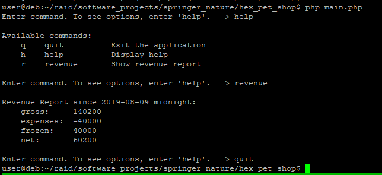
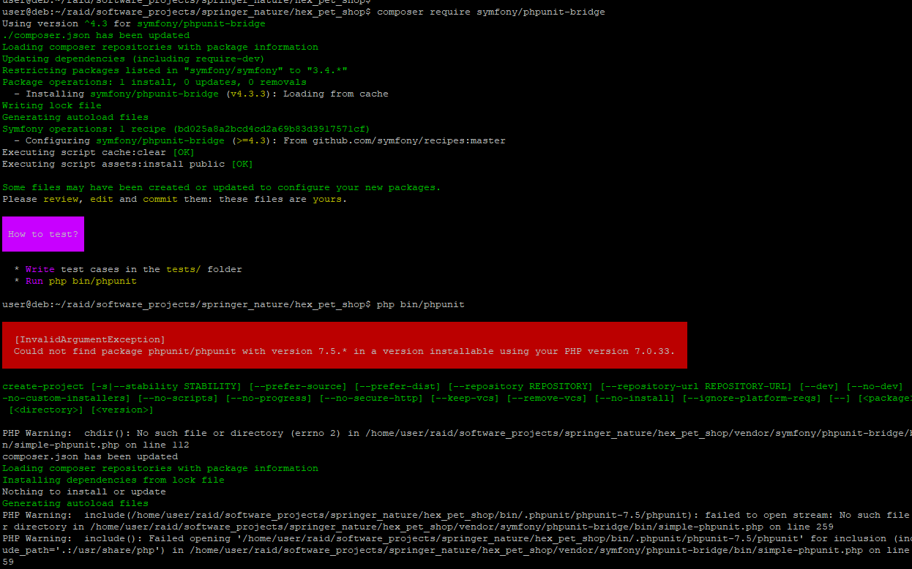

# WHAT IS THIS?
-------------------------------------------------------------------------------

This is a PHP console application that demonstrates the Hexagonal architecture.

# TECHNICAL SPECIFICATIONS
-------------------------------------------------------------------------------

- PHP 7.0.33-0+deb9u3 (cli) (built: Mar  8 2019 10:01:24) ( NTS )
- Debian operating system
- Symfony, for PHP framework and testing framework
- Composer, for PHP package management


# HOW TO BUILD
-------------------------------------------------------------------------------

Download project:

https://github.com/paperduck/sn

If you have PHP and Composer installed, you should be able to run it:

https://symfony.com/doc/current/deployment.html

# HOW TO USE
-------------------------------------------------------------------------------

```
$ cd hex_pet_shop
$ php main.php
```

You will be prompted for commands. You can type 'help' to see a list of
options.

# TESTING
-------------------------------------------------------------------------------

Unit tests for revenue functions:

tests/Infrastructure/ServicesTest.php

phpunit-bridge failed to install correctly (screenshot below). You can still
view the unit tests written.

# REFERENCES
-------------------------------------------------------------------------------

### URLs

PHP flat file database to store data with JSON: 
https://github.com/Greg0/Lazer-Database

Epoch Converter: 
https://www.epochconverter.com/


# DB schema
-------------------------------------------------------------------------------

This is a rough outline of what tables would be needed.

Note: The schema is not normalized, for the sake of simplicity.

```
customer
--------
id
name
contact

transactions
------------
id
fk_customer_id            
fk_inventory_id           
type                    
timestamp               
amount                  
insured                 
insuranceLengthInDays  

transaction_type
----------------
id
type        // sale, return, reserve, pickup, chip

pet-type
--------
id
type        // cat, bird, dog, etc.

inventory
---------
id
fk_customer_id
fk_pet_type
isInsured                 
returnDate      // NULL if never returned
refundPercentGranted
insuranceFeePaid
saleDate
returnedDate
isReserved:Bool 
customer-id
chipId:String
hasChip:Bool
implantDate
pet name
DOB
showroomDesc

notifications
-------------
id
msg    
isRead 

notification-schedule
---------------------
id
last-notified-pets-going-to-vet
```


# SCREENSHOT




